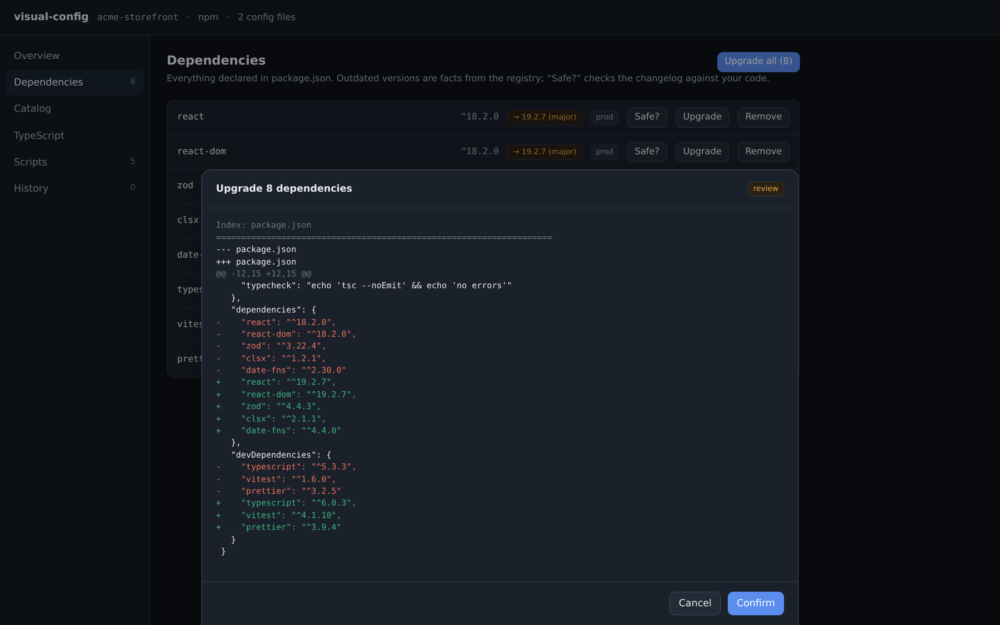

<h1 align="center">visual-config</h1>
<p align="center"><em>One surface for every config.</em></p>

<p align="center">
A visual control surface for JavaScript/TypeScript project configuration —
dependencies, scripts, TypeScript, linters, framework config, and npm
publishing — that lives <strong>on top of</strong> the config files you
already have.
</p>

> [!IMPORTANT]
> **Status: alpha, published to npm.** Try it in any JS/TS project:
> `npx @apostel/visual-config`. A lot works today — the browser UI, dependency
> health (outdated **+ vulnerabilities + deprecations**), the config editor for
> JSON configs, tool scaffolding, a one-click **Switch to Biome**, changelog
> reading, an MCP server with in-session app UI, and the plugin system. See
> [what works today](#what-works-today). Still intended-but-not-built: monorepo
> support, framework-config forms, IDE panels — see [`docs/ROADMAP.md`](docs/ROADMAP.md).
>
> _`visual-config` is a descriptive package name, not a brand — see [`docs/DESIGN-LANGUAGE.md`](docs/DESIGN-LANGUAGE.md)._

---

## See it

The **[homepage](https://sam-apostel.github.io/project-config-tools/)** has live
screenshots, an interactive tour of the plan→review→apply→undo loop, a clickable
map of every package, and the roadmap — all sourced from [`site/`](site/).

<p align="center">
  
</p>

---

## What works today

Install-free: `npx @apostel/visual-config` in any JS/TS project.

- 🟢 A local daemon + **React UI**: **Overview** (inline-editable name/version/description),
  **Dependencies**, **Config**, **TypeScript**, **Catalog**, **Scripts**, **History**
- 🟢 **Dependency health** — facts from the registry: **outdated**, **vulnerabilities**
  (npm advisory DB), and **deprecations** (with the maintainer's suggested alternative)
- 🟢 **Changelog viewer** — read GitHub release notes between your version and latest, with
  breaking changes highlighted; plus **bump-safety analysis** that cross-references those
  breaking changes against how _your_ code actually uses the package
- 🟢 **Package catalog** — search the npm registry, install by selecting (no free-typed name)
- 🟢 **Config editor** — view & edit **Biome / Prettier / ESLint / oxlint / tsconfig** as
  guided forms with inline docs; **read-only views** of JS/TS configs (`next.config`,
  `vite.config`, eslint flat) via static extraction
- 🟢 **Set up a tool** in one step (scaffold Prettier / Biome / oxlint), and a one-click
  **Switch to Biome** that replaces ESLint + Prettier — both fully reversible
- 🟢 **Run scripts** as buttons with streamed output and a **Stop** control
- 🟢 The **Diff Sheet** — every mutation previewed and confirmed, with **undo**
- 🟢 **MCP server** (`visual-config mcp`) exposing every operation as an agent tool, plus
  read-only resources and an **in-session app UI** (MCP Apps / SEP-1865); `init-mcp`
  registers it for teammates and cloud agents
- 🟢 **Plugin system** + **attributed opinion packs** — the neutral base ships only facts;
  taste comes from packs you install (`@apostel/visual-config-kit`)

Everything writes through a **format- and comment-preserving** layer; files stay the only
source of truth. Published under `@apostel/*` via an automated OIDC pipeline.

🟡 **Not yet:** monorepo/workspace support, lockfile-exact diagnostics, guided
framework-config _editing_, a headless `check` mode, and IDE panels — see the
[roadmap](docs/ROADMAP.md).

---

## Why

Configuring a JS/TS project means hand-editing a dozen text files —
`package.json`, `tsconfig.json`, `next.config.js`, ESLint/Prettier/Biome
configs — that reward memorizing schemas and command flags over engineering.
It drifts, it conflicts in merges, and a single `npx` typo can execute an
arbitrary package. visual-config gives that configuration a real interface while
keeping the files as the source of truth. Read the [Manifesto](MANIFESTO.md).

## What it does (intended)

- **See everything in `package.json`** — deps, scripts, metadata, workspaces,
  publish config — in a clean, glanceable UI instead of a JSON blob.
- **Package health** — vulnerabilities, outdated deps, and deprecations
  surfaced with severity, each with an **Upgrade** or **Migrate** button that
  previews the exact change.
- **Know which upgrades are safe** — for every outdated dep, read the changelog
  between your version and the latest, with breaking changes flagged and
  cross-referenced against _your_ code so you (or an AI) can tell which major
  bumps are actually safe to take. Migrations are backed by codemods or, where
  none exist, maintainer-authored agent skills.
- **Install from a catalog** — browse packages with search and filters
  (types, size, popularity, license, maintained). Installing is _selecting_,
  not typing a name into a command. No free-typed install path.
- **Run scripts as buttons** — every `package.json` script becomes a labeled
  button with live output. No recalling incantations.
- **Understand your TypeScript setup** — see effective compiler options and
  what's non-default, as neutral facts. (Suggestions like "turn on `strict`"
  come from opinion packs you install — see below — never baked in.)
- **Neutral base, installable opinions** — out of the box the tool states only
  _facts_ (vulnerable, outdated, type-wrong, non-default). Want guidance?
  Install an **opinion pack** attributed to someone you trust — the TypeScript
  team, Matt Pocock, Vercel, Tanner — and its recommendations appear, labeled as
  theirs. Stack several; see where they disagree; pick. The maintainer's taste
  is never in the tool.
- **Guided framework config** — e.g. add an allowed image domain to
  `next.config` through a form with inline helper docs, not by guessing the
  key shape.
- **One-click tooling swaps** — move between Biome and ESLint+Prettier, or to
  oxlint/oxfmt, with a full preview of every file added/removed/changed.
- **npm publish setup** — scaffold and audit `exports`, `files`, provenance,
  and metadata against the latest recommendations, docs in reach.
- **Extensible via plugins** — tool owners ship their own vertical. An `oxc`
  plugin can add oxlint/oxfmt catalog filters, a config UI, and the swaps; a
  `tanstack` plugin can add docs for TypeScript/dev-server/testing and its own
  panel. The built-in features are themselves plugins on the same API.
- **Every change is a reviewed diff** — nothing is written without showing you
  the exact file change first. Reversible by default. The same operations are
  available to AI agents over MCP, with the same guardrails.

## How you'll use it (intended)

### 1. The `npx` command (Phase 1)

```bash
# In any JS/TS project directory:
npx @apostel/visual-config
```

This opens visual-config in your browser, pointed at the current project. It reads
your real config files, presents them as a UI, and writes changes back as
minimal diffs you confirm. Install it locally to pin a version:

```bash
npm install -D @apostel/visual-config   # then: npx @apostel/visual-config  (or a "visual-config" script)
```

> [!NOTE]
> **On the "npx typo" concern:** the point of visual-config is precisely to _stop_
> installing packages by typing names into commands. You run one trusted,
> pinned command (`visual-config`) and then install everything else by selecting it
> from a catalog backed by verified registry data. See the safety model in
> [`docs/ANALYSIS.md`](docs/ANALYSIS.md).

### 2. The IDE panels (Phase 6)

VS Code and JetBrains extensions embed the same surface as a **project config
panel** next to your code — with an optional **cleaner-workspace** toggle that
tidies config files out of the file tree using **native IDE features** (file
nesting, `files.exclude`). It's decluttering, not lock-away: the files stay on
disk, git and every other tool still see them, and a persistent "Reveal in
Explorer" is always one click away. **Zed** can't embed the panel (its
extensions have no webview API), but it's **natively MCP-first**, so it gets our
config tools in its agent panel plus a browser handoff for the UI. One core
engine, shown wherever it fits. Feasibility and limits in
[`docs/IDE-INTEGRATION.md`](docs/IDE-INTEGRATION.md); design in
[`docs/spec/06-ide-surface.md`](docs/spec/06-ide-surface.md).

### 3. The MCP server (for agents)

Every operation visual-config exposes as a button — install, upgrade, migrate, switch
linter, add an image domain — is also exposed as an **MCP server** so AI
agents get _guided, validated, reversible_ config tools instead of free-typing
shell commands:

```bash
# Intended: run visual-config's tools as an MCP server for your agent
npx @apostel/visual-config mcp
```

Agents call the same guardrailed operations you do — diffs, validation, undo —
which is exactly where you want them constrained as they take on more work.

## Principles you can rely on

- **Your files stay the source of truth.** No shadow config, no lock-in.
  Uninstalling leaves your project byte-for-byte as it was.
- **Minimal diffs, preserved formatting** and comments where the format allows.
- **Nothing writes without a confirmed diff.** Human or agent.
- **Reversible by default.**

## Documentation

| Doc                                                | What's in it                                                                                                            |
| -------------------------------------------------- | ----------------------------------------------------------------------------------------------------------------------- |
| [MANIFESTO.md](MANIFESTO.md)                       | Why this exists and what we believe                                                                                     |
| [docs/ANALYSIS.md](docs/ANALYSIS.md)               | What's possible + feasibility score on every part of the vision                                                         |
| [docs/ROADMAP.md](docs/ROADMAP.md)                 | Phased plan from `npx` tool to IDE plugins to MCP                                                                       |
| [docs/PRIOR-ART.md](docs/PRIOR-ART.md)             | Existing projects in this space and the gap we fill                                                                     |
| [docs/IDE-INTEGRATION.md](docs/IDE-INTEGRATION.md) | How deep IDE integration can realistically go                                                                           |
| [docs/DESIGN-LANGUAGE.md](docs/DESIGN-LANGUAGE.md) | Visual + interaction design system                                                                                      |
| [docs/spec/](docs/spec/)                           | **Concrete technical specs** — architecture, core engine, plugin API, config adapters, migrations, MCP/RPC, IDE surface |

## Run it from source (Development)

The tool isn't published yet, but you can run it from this repo. Requires
Node ≥20 and pnpm.

```bash
pnpm install
pnpm build:ui                 # build the React SPA the daemon serves
pnpm --filter @apostel/visual-config exec tsx src/bin.ts --cwd /path/to/your/project
# → opens http://127.0.0.1:<port> in your browser

# Or the MCP server for an agent (stdio):
pnpm --filter @apostel/visual-config exec tsx src/bin.ts mcp --cwd /path/to/your/project
```

Workspace layout (see [`docs/spec/00-architecture.md`](docs/spec/00-architecture.md)):

| Package                           | Role                                                                                                     |
| --------------------------------- | -------------------------------------------------------------------------------------------------------- |
| `@apostel/visual-config-core`     | headless engine: project model, operations, Change/undo, format-preserving writers, registry/diagnostics |
| `@apostel/visual-config-protocol` | shared birpc contract (types only)                                                                       |
| `@apostel/visual-config-server`   | local daemon (HTTP static SPA + WebSocket birpc + script tasks)                                          |
| `@apostel/visual-config-ui`       | the React SPA (browser + future IDE webview)                                                             |
| `@apostel/visual-config-mcp`      | MCP server projecting operations as agent tools                                                          |
| `visual-config` (cli)             | the `visual-config` bin                                                                                  |

```bash
pnpm test         # unit + daemon integration tests
pnpm typecheck    # tsc across the workspace
pnpm format       # prettier
```

## Extending it (plugins & opinions)

Plugins are auto-discovered from your project's dependencies (any package whose
`package.json` has a `visual-config` field or the `visual-config-plugin`
keyword). A plugin adds operations, detectors, or **attributed opinions**:

```ts
import { definePlugin } from '@apostel/visual-config-kit';

export default definePlugin({
  id: 'my-opinions',
  setup(ctx) {
    ctx.registerImprovement({
      id: 'strict',
      applies: (project) => project.configFiles.some((f) => f.kind === 'tsconfig'),
      suggest: () => ({
        id: 'enable-strict',
        title: 'Enable TypeScript `strict`',
        detail: 'Catches many bugs at compile time.',
        author: { name: 'You', kind: 'person', official: false },
        apply: { operationId: 'set-tsconfig-option', input: { key: 'strict', value: true } },
      }),
    });
  },
});
```

The **base ships no opinions**. Recommendations appear only from packs you
install, always labeled with their author — see
[`packages/opinion-ts-strict`](packages/opinion-ts-strict) for a worked example
and [`docs/spec/07-opinions.md`](docs/spec/07-opinions.md) for the design.

## Releasing

Releases are driven by [Changesets](https://github.com/changesets/changesets) and
GitHub Actions. To record a change, run `pnpm changeset` and describe it. When that
lands on `main`, the [release workflow](.github/workflows/release.yml) opens a
**Version Packages** PR that bumps every package (they version in lockstep) and writes
each `CHANGELOG.md`. Merging that PR publishes all packages to npm and cuts a matching
**GitHub Release** with the same notes.

Every package publishes under the [`@apostel`](https://www.npmjs.com/org/apostel)
scope. One-time setup by a maintainer: add an automation `NPM_TOKEN` (from an npm
account with publish rights to the scope) as a repo Actions secret. Nothing else is
manual.

## Status & contributing

Early alpha. Issues and design discussion welcome. See the [roadmap](docs/ROADMAP.md)
for the current milestone and open questions.

## License

See [LICENSE](LICENSE).
